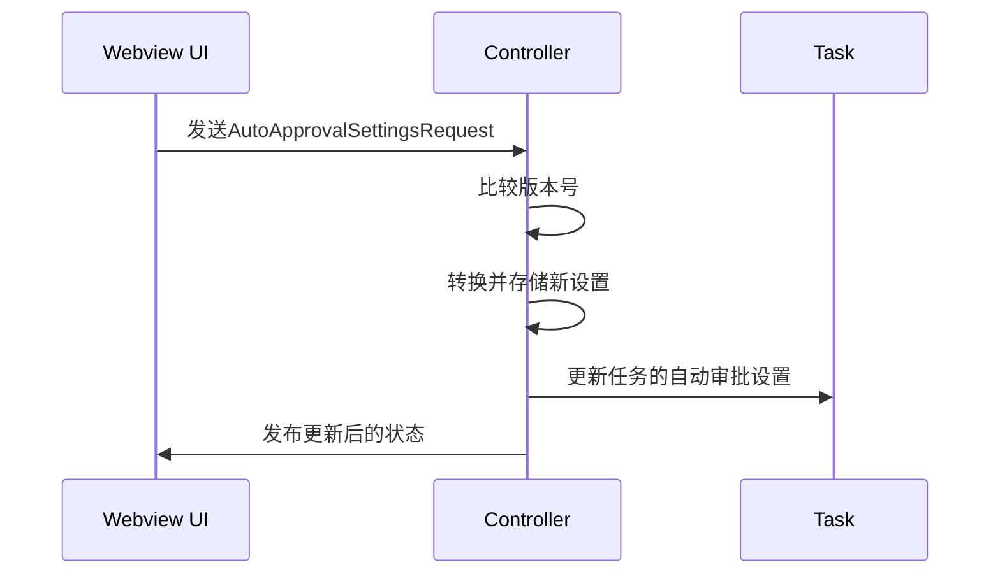
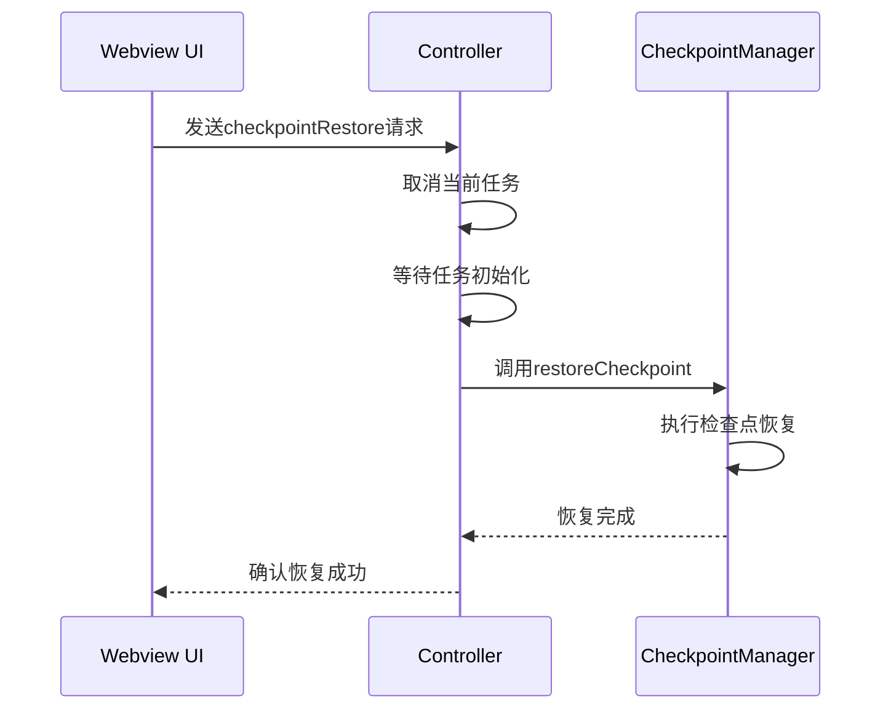

# 高级功能

<cite>
**本文档中引用的文件**  
- [ContextManager.ts](file://src/core/context/context-management/ContextManager.ts)
- [updateAutoApprovalSettings.ts](file://src/core/controller/state/updateAutoApprovalSettings.ts)
- [checkpointDiff.ts](file://src/core/controller/checkpoints/checkpointDiff.ts)
- [checkpointRestore.ts](file://src/core/controller/checkpoints/checkpointRestore.ts)
- [grpc-handler.ts](file://src/core/controller/grpc-handler.ts)
- [condense.ts](file://src/core/controller/slash/condense.ts)
</cite>

## 目录
1. [上下文管理系统](#上下文管理系统)
2. [自动审批功能](#自动审批功能)
3. [检查点系统](#检查点系统)
4. [斜杠命令](#斜杠命令)

## 上下文管理系统

Cline的上下文管理系统通过`ContextManager`类智能地管理对话历史中的上下文信息，以优化LLM的提示效果并防止超出模型的上下文窗口限制。该系统通过分析对话历史中的文件读取、代码片段和URL等信息，自动进行上下文优化和压缩。

`ContextManager`的核心机制是维护一个`contextHistoryUpdates`映射，该映射记录了对话历史中每个消息的更新操作。这些更新包括文件读取的去重、对话历史的截断通知等。系统会根据模型的上下文窗口大小和当前的token使用情况，决定是否需要压缩上下文窗口。

当系统检测到前一次API请求的总token使用量接近或超过模型的上下文窗口限制时，它会自动触发上下文压缩。压缩策略根据上下文压力的严重程度而有所不同：对于中等压力，系统会移除一半的对话历史；对于严重压力，则会移除四分之三的对话历史。这种自适应策略确保了在不同模型（如Claude的200K上下文窗口与DeepSeek的64K上下文窗口）之间切换时，系统仍能有效工作。

上下文优化的一个关键功能是文件读取的去重。当系统检测到同一文件被多次读取时，它会将后续的文件内容替换为"文件内容已显示"的提示，从而节省大量上下文空间。这种优化通过分析`read_file`、`write_to_file`和`replace_in_file`等工具调用的输出来实现。

**Section sources**
- [ContextManager.ts](file://src/core/context/context-management/ContextManager.ts#L42-L957)

## 自动审批功能

Cline的自动审批功能允许用户配置规则，以自动化批准文件修改和终端命令等操作，从而提高工作效率。该功能的配置通过UI界面进行，用户可以为不同类型的工具设置自动批准规则。

后端通过`updateAutoApprovalSettings`控制器处理这些配置。当用户在UI中更改自动审批设置时，前端会发送一个包含新设置的`AutoApprovalSettingsRequest`。控制器接收到请求后，会比较请求中的版本号与当前设置的版本号，只有当请求的版本号更高时才会更新设置，这确保了设置的一致性。

更新设置的主要流程如下：
1. 将协议缓冲区格式的请求转换为内部设置对象
2. 将新的设置存储在全局状态管理器中
3. 如果当前有活动任务，则通知该任务更新其自动审批设置
4. 向Webview发布更新后的状态，以保持UI同步



**Diagram sources**
- [updateAutoApprovalSettings.ts](file://src/core/controller/state/updateAutoApprovalSettings.ts#L6-L31)

**Section sources**
- [updateAutoApprovalSettings.ts](file://src/core/controller/state/updateAutoApprovalSettings.ts#L6-L31)

## 检查点系统

Cline的检查点系统允许用户创建代码变更的快照，比较不同版本之间的差异，并在需要时恢复到之前的代码状态。该系统在`grpc-handler`中实现，通过gRPC服务处理来自Webview的请求。

创建差异的流程如下：
1. 用户在UI中选择要比较的检查点
2. Webview发送`checkpointDiff`请求到控制器
3. 控制器调用`checkpointManager`的`presentMultifileDiff`方法
4. 系统生成并显示多文件差异视图

恢复代码的完整流程包括：
1. 用户在UI中选择要恢复的检查点
2. Webview发送`checkpointRestore`请求到控制器
3. 控制器首先取消当前任务，以避免状态冲突
4. 等待消息系统初始化完成
5. 调用`checkpointManager`的`restoreCheckpoint`方法执行恢复



**Diagram sources**
- [checkpointRestore.ts](file://src/core/controller/checkpoints/checkpointRestore.ts#L6-L33)
- [checkpointDiff.ts](file://src/core/controller/checkpoints/checkpointDiff.ts#L6-L9)

**Section sources**
- [checkpointRestore.ts](file://src/core/controller/checkpoints/checkpointRestore.ts#L6-L33)
- [checkpointDiff.ts](file://src/core/controller/checkpoints/checkpointDiff.ts#L6-L9)

## 斜杠命令

Cline支持多种斜杠命令，其中`/condense`是一个重要的功能。该命令用于压缩当前对话，通常在用户确认AI的响应后触发。

`/condense`命令的实现非常简洁，它通过调用控制器的任务实例的`handleWebviewAskResponse`方法，并传入"yesButtonClicked"作为参数来模拟用户点击"是"按钮的操作。这会触发对话压缩流程，将当前的上下文信息进行优化和整理。

```mermaid
flowchart TD
A[/condense命令] --> B{调用handleWebviewAskResponse}
B --> C[传入\"yesButtonClicked\"参数]
C --> D[触发对话压缩]
D --> E[优化和整理上下文]
E --> F[完成压缩]
```

**Diagram sources**
- [condense.ts](file://src/core/controller/slash/condense.ts#L6-L9)

**Section sources**
- [condense.ts](file://src/core/controller/slash/condense.ts#L6-L9)