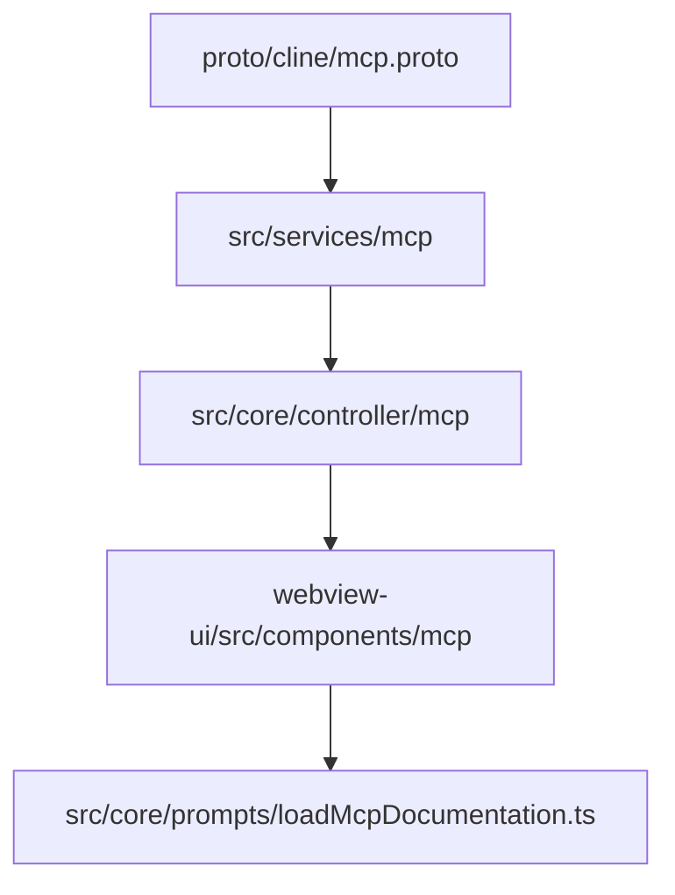
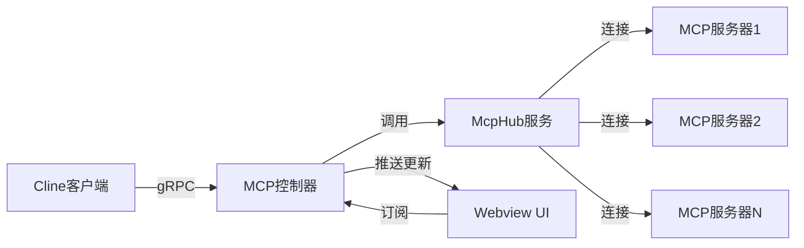
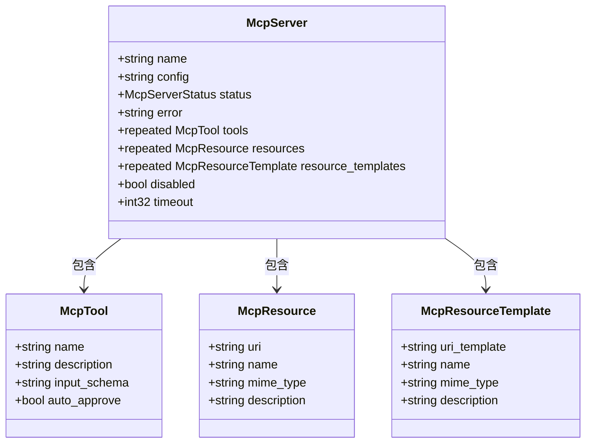
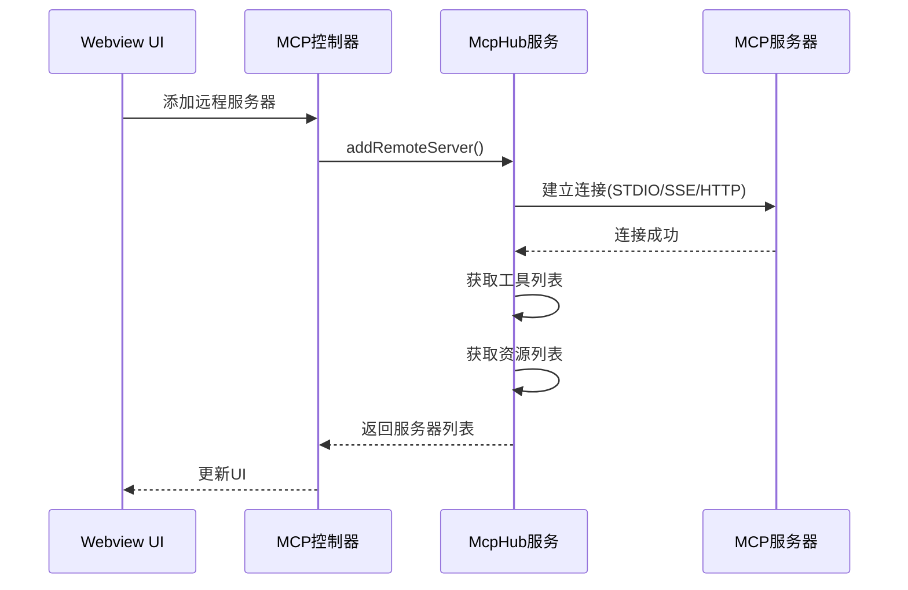
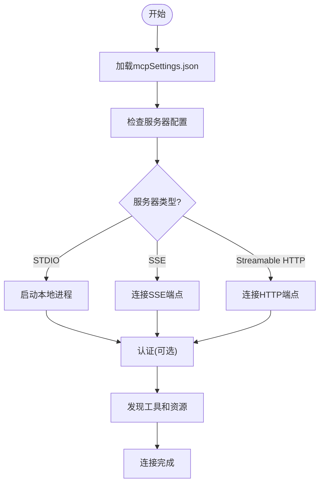
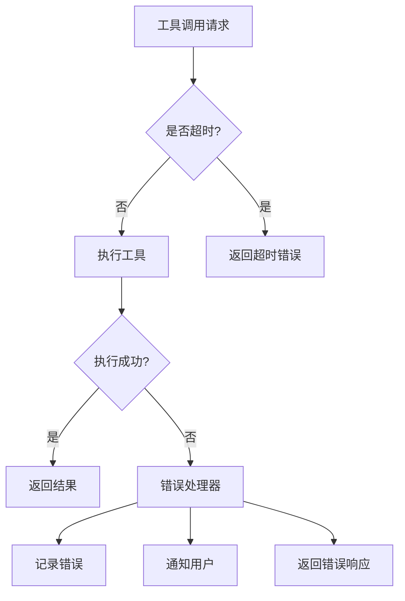

# MCP扩展

<cite>
**本文档中引用的文件**  
- [mcp.proto](file://proto/cline/mcp.proto)
- [addRemoteMcpServer.ts](file://src/core/controller/mcp/addRemoteMcpServer.ts)
- [McpHub.ts](file://src/services/mcp/McpHub.ts)
- [schemas.ts](file://src/services/mcp/schemas.ts)
- [McpConfigurationView.tsx](file://webview-ui/src/components/mcp/configuration/McpConfigurationView.tsx)
- [ServerRow.tsx](file://webview-ui/src/components/mcp/configuration/tabs/installed/server-row/ServerRow.tsx)
- [loadMcpDocumentation.ts](file://src/core/prompts/loadMcpDocumentation.ts)
</cite>

## 目录
1. [引言](#引言)
2. [项目结构](#项目结构)
3. [核心组件](#核心组件)
4. [架构概述](#架构概述)
5. [详细组件分析](#详细组件分析)
6. [依赖分析](#依赖分析)
7. [性能考虑](#性能考虑)
8. [故障排除指南](#故障排除指南)
9. [结论](#结论)

## 引言
MCP（Model Context Protocol）扩展机制是Cline平台的核心功能之一，它允许开发者通过标准化协议集成外部工具和服务。本文档详细阐述了MCP的设计理念、实现方式以及如何创建和注册自定义MCP工具，涵盖从定义JSON Schema到在Cline中调用的完整流程。

## 项目结构
MCP相关代码分布在多个目录中，主要包括协议定义、控制器逻辑、服务层和UI配置界面。



**Diagram sources**
- [mcp.proto](file://proto/cline/mcp.proto)
- [McpHub.ts](file://src/services/mcp/McpHub.ts)
- [addRemoteMcpServer.ts](file://src/core/controller/mcp/addRemoteMcpServer.ts)
- [McpConfigurationView.tsx](file://webview-ui/src/components/mcp/configuration/McpConfigurationView.tsx)

**Section sources**
- [mcp.proto](file://proto/cline/mcp.proto)
- [McpHub.ts](file://src/services/mcp/McpHub.ts)

## 核心组件
MCP的核心组件包括协议定义、服务管理器（McpHub）、控制器和Webview UI。McpHub负责管理所有MCP服务器的连接状态、工具发现和资源访问。

**Section sources**
- [McpHub.ts](file://src/services/mcp/McpHub.ts)
- [schemas.ts](file://src/services/mcp/schemas.ts)

## 架构概述
MCP采用客户端-服务器模型，通过gRPC进行通信。Cline作为MCP客户端，与各种MCP服务器建立连接，发现可用工具和资源，并执行远程调用。



**Diagram sources**
- [mcp.proto](file://proto/cline/mcp.proto)
- [McpHub.ts](file://src/services/mcp/McpHub.ts)
- [addRemoteMcpServer.ts](file://src/core/controller/mcp/addRemoteMcpServer.ts)

## 详细组件分析

### MCP协议定义
MCP协议在`mcp.proto`中定义，包含服务器、工具、资源等核心消息类型。



**Diagram sources**
- [mcp.proto](file://proto/cline/mcp.proto)

**Section sources**
- [mcp.proto](file://proto/cline/mcp.proto)

### MCP服务管理
McpHub是MCP服务的核心管理器，负责连接、断开、重启和监控所有MCP服务器。



**Diagram sources**
- [McpHub.ts](file://src/services/mcp/McpHub.ts)
- [addRemoteMcpServer.ts](file://src/core/controller/mcp/addRemoteMcpServer.ts)

**Section sources**
- [McpHub.ts](file://src/services/mcp/McpHub.ts)

### 自定义MCP工具创建
创建自定义MCP工具需要定义工具的JSON Schema、实现服务器端逻辑，并在Cline中注册。

#### 工具定义示例（Jira）
```json
{
  "name": "getIssue",
  "description": "获取Jira问题详情",
  "input_schema": {
    "type": "object",
    "properties": {
      "issueId": {
        "type": "string",
        "description": "Jira问题ID"
      }
    },
    "required": ["issueId"]
  }
}
```

#### 服务器端实现（Node.js）
```javascript
// 使用MCP SDK创建服务器
const { Server } = require('@modelcontextprotocol/sdk/server')

const server = new Server({
  name: 'jira-mcp',
  version: '1.0.0'
})

server.addTool({
  name: 'getIssue',
  description: '获取Jira问题详情',
  inputSchema: {/* 上述Schema */},
  handler: async (params) => {
    // 调用Jira API
    const issue = await jiraClient.getIssue(params.issueId)
    return { result: issue }
  }
})
```

#### 在Cline中注册
```typescript
// 通过addRemoteMcpServer注册
await McpServiceClient.addRemoteMcpServer({
  serverName: "jira",
  serverUrl: "http://localhost:8080"
})
```

**Section sources**
- [McpHub.ts](file://src/services/mcp/McpHub.ts)
- [schemas.ts](file://src/services/mcp/schemas.ts)

### 服务发现与认证
MCP支持多种传输方式（STDIO、SSE、Streamable HTTP），并通过配置文件管理服务器连接信息。



**Diagram sources**
- [McpHub.ts](file://src/services/mcp/McpHub.ts)
- [schemas.ts](file://src/services/mcp/schemas.ts)

**Section sources**
- [McpHub.ts](file://src/services/mcp/McpHub.ts)

### 超时与错误处理
MCP提供可配置的超时设置和全面的错误处理机制。



**Diagram sources**
- [McpHub.ts](file://src/services/mcp/McpHub.ts)
- [ServerRow.tsx](file://webview-ui/src/components/mcp/configuration/tabs/installed/server-row/ServerRow.tsx)

**Section sources**
- [McpHub.ts](file://src/services/mcp/McpHub.ts)

## 依赖分析
MCP系统依赖于多个外部库和内部服务。

```mermaid
graph TD
McpHub --> Zod[zod]
McpHub --> Chokidar[chokidar]
McpHub --> ReconnectingEventSource[reconnecting-eventsource]
McpHub --> ModelContextProtocolSDK[@modelcontextprotocol/sdk]
McpHub --> HostProvider[HostProvider]
McpHub --> TelemetryService[TelemetryService]
Controller --> McpHub
Webview --> Controller
```

**Diagram sources**
- [McpHub.ts](file://src/services/mcp/McpHub.ts)
- [schemas.ts](file://src/services/mcp/schemas.ts)

**Section sources**
- [McpHub.ts](file://src/services/mcp/McpHub.ts)

## 性能考虑
- **连接管理**：McpHub维护所有服务器的持久连接，避免重复建立连接的开销
- **缓存机制**：工具和资源列表在连接时获取并缓存，减少重复查询
- **异步操作**：所有I/O操作均采用异步方式，避免阻塞主线程
- **错误恢复**：通过ReconnectingEventSource实现自动重连，提高系统可用性

## 故障排除指南
常见问题及解决方案：

1. **服务器连接失败**
   - 检查服务器URL是否正确
   - 验证服务器是否正在运行
   - 检查防火墙设置

2. **工具调用超时**
   - 增加`timeout`配置值
   - 检查网络连接质量
   - 优化服务器端处理逻辑

3. **认证失败**
   - 验证API密钥或令牌
   - 检查权限设置
   - 确认认证头格式正确

4. **工具未发现**
   - 确认服务器正确实现了`tools/list`方法
   - 检查工具定义的JSON Schema是否有效
   - 验证服务器版本兼容性

**Section sources**
- [McpHub.ts](file://src/services/mcp/McpHub.ts)
- [ServerRow.tsx](file://webview-ui/src/components/mcp/configuration/tabs/installed/server-row/ServerRow.tsx)

## 结论
MCP扩展机制为Cline提供了强大的外部集成能力。通过标准化的协议和灵活的架构，开发者可以轻松创建和集成各种工具和服务。建议在开发自定义MCP工具时遵循最佳实践，包括提供清晰的文档、实现健壮的错误处理和确保良好的性能表现。