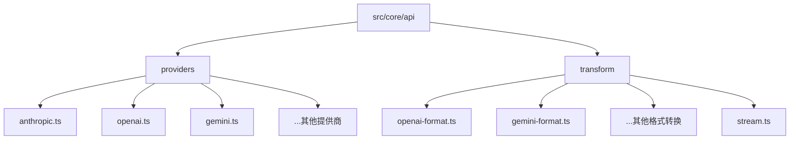
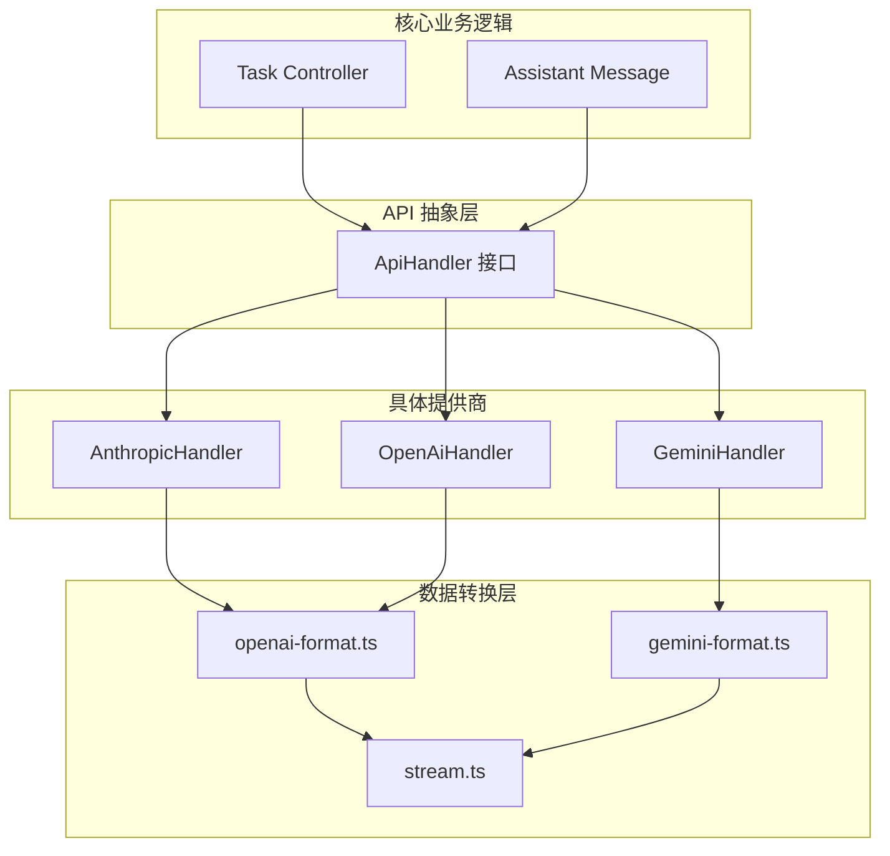

# LLM提供商集成

<cite>
**本文档中引用的文件**  
- [anthropic.ts](file://src/core/api/providers/anthropic.ts)
- [openai.ts](file://src/core/api/providers/openai.ts)
- [gemini.ts](file://src/core/api/providers/gemini.ts)
- [types.ts](file://src/core/api/providers/types.ts)
- [openai-format.ts](file://src/core/api/transform/openai-format.ts)
- [gemini-format.ts](file://src/core/api/transform/gemini-format.ts)
- [stream.ts](file://src/core/api/transform/stream.ts)
- [index.ts](file://src/core/api/index.ts)
</cite>

## 目录
1. [简介](#简介)
2. [项目结构](#项目结构)
3. [核心组件](#核心组件)
4. [架构概述](#架构概述)
5. [详细组件分析](#详细组件分析)
6. [依赖分析](#依赖分析)
7. [性能考量](#性能考量)
8. [故障排除指南](#故障排除指南)
9. [结论](#结论)

## 简介
本文档旨在为将新的大型语言模型（LLM）提供商集成到Cline平台提供一份详尽的技术指南。我们将深入分析现有提供商（如Anthropic、OpenAI、Gemini）的实现模式，重点阐述它们如何继承和实现`BaseProvider`接口。文档将详细说明创建一个新的提供商类（例如`MyNewProvider.ts`）的完整步骤，涵盖认证处理（API密钥、OAuth、会话令牌等）、HTTP请求构建、流式响应处理以及错误码映射等关键环节。此外，我们还将探讨请求和响应的转换层，解释如何利用`openai-format.ts`或`gemini-format.ts`等文件将不同提供商的专有格式标准化为Cline内部统一的格式。最后，文档将提供一个完整的代码示例，并讨论集成过程中的性能优化策略。

## 项目结构
Cline的LLM提供商集成主要围绕`src/core/api/`目录下的两个核心子目录：`providers`和`transform`。`providers`目录包含了所有具体LLM提供商的实现类，每个类都遵循统一的接口规范。`transform`目录则负责处理不同提供商之间的数据格式转换，确保核心业务逻辑与底层提供商解耦。



**Diagram sources**
- [src/core/api/providers](file://src/core/api/providers)
- [src/core/api/transform](file://src/core/api/transform)

**Section sources**
- [src/core/api/providers](file://src/core/api/providers)
- [src/core/api/transform](file://src/core/api/transform)

## 核心组件
本节将分析`src/core/api/providers/`目录下现有提供商的核心实现模式。所有提供商均通过实现`ApiHandler`接口来提供统一的API调用能力。该接口定义了`createMessage`方法用于发起流式对话请求，以及`getModel`方法用于获取当前使用的模型信息。提供商的实现通常包括客户端初始化、认证处理、请求构建、流式响应解析和错误处理等核心功能。

**Section sources**
- [anthropic.ts](file://src/core/api/providers/anthropic.ts#L1-L247)
- [openai.ts](file://src/core/api/providers/openai.ts#L1-L141)
- [gemini.ts](file://src/core/api/providers/gemini.ts#L1-L473)
- [index.ts](file://src/core/api/index.ts#L44-L48)

## 架构概述
Cline的LLM提供商集成架构采用分层设计，核心是`ApiHandler`接口。所有具体的提供商（如Anthropic、OpenAI、Gemini）都作为`ApiHandler`的实现类存在。当核心业务逻辑需要调用LLM时，它通过`ApiHandler`接口与具体的提供商进行交互，而无需关心底层实现细节。数据转换层位于提供商和核心逻辑之间，负责将Cline内部使用的Anthropic格式消息转换为各提供商所需的格式，并将提供商的响应转换回统一的流式数据结构。



**Diagram sources**
- [index.ts](file://src/core/api/index.ts#L44-L48)
- [anthropic.ts](file://src/core/api/providers/anthropic.ts#L1-L247)
- [openai.ts](file://src/core/api/providers/openai.ts#L1-L141)
- [gemini.ts](file://src/core/api/providers/gemini.ts#L1-L473)
- [openai-format.ts](file://src/core/api/transform/openai-format.ts#L1-L210)
- [gemini-format.ts](file://src/core/api/transform/gemini-format.ts#L1-L84)
- [stream.ts](file://src/core/api/transform/stream.ts#L1-L23)

## 详细组件分析
本节将深入分析关键组件的实现细节，为新提供商的集成提供具体指导。

### 现有提供商实现模式分析
现有提供商（Anthropic、OpenAI、Gemini）均遵循相似的实现模式。它们都定义了一个继承自`ApiHandler`接口的类（如`AnthropicHandler`、`OpenAiHandler`、`GeminiHandler`），并在构造函数中接收一个包含认证信息和配置选项的对象。`ensureClient`方法负责懒加载并初始化底层SDK客户端，确保在首次调用API时才进行资源消耗。`createMessage`方法是核心，它接收系统提示和消息历史，构建并发送请求，然后将流式响应转换为Cline内部定义的`ApiStream`格式。

#### 对于对象导向的组件：
```mermaid
classDiagram
class ApiHandler {
<<interface>>
+createMessage(systemPrompt : string, messages : MessageParam[]) : ApiStream
+getModel() : { id : string; info : ModelInfo }
}
class AnthropicHandler {
-options : AnthropicHandlerOptions
-client : Anthropic | undefined
+constructor(options : AnthropicHandlerOptions)
-ensureClient() : Anthropic
+createMessage(systemPrompt : string, messages : MessageParam[]) : ApiStream
+getModel() : { id : AnthropicModelId; info : ModelInfo }
}
class OpenAiHandler {
-options : OpenAiHandlerOptions
-client : OpenAI | undefined
+constructor(options : OpenAiHandlerOptions)
-ensureClient() : OpenAI
+createMessage(systemPrompt : string, messages : MessageParam[]) : ApiStream
+getModel() : { id : string; info : ModelInfo }
}
class GeminiHandler {
-options : GeminiHandlerOptions
-client : GoogleGenAI | undefined
+constructor(options : GeminiHandlerOptions)
-ensureClient() : GoogleGenAI
+createMessage(systemPrompt : string, messages : MessageParam[]) : ApiStream
+getModel() : { id : GeminiModelId; info : ModelInfo }
+calculateCost(...) : number | undefined
}
ApiHandler <|-- AnthropicHandler
ApiHandler <|-- OpenAiHandler
ApiHandler <|-- GeminiHandler
```

**Diagram sources**
- [index.ts](file://src/core/api/index.ts#L44-L48)
- [anthropic.ts](file://src/core/api/providers/anthropic.ts#L1-L247)
- [openai.ts](file://src/core/api/providers/openai.ts#L1-L141)
- [gemini.ts](file://src/core/api/providers/gemini.ts#L1-L473)

### 创建新的提供商类
要创建一个新的提供商类（例如`MyNewProvider.ts`），请遵循以下步骤：

1.  **定义配置选项接口**：创建一个名为`MyNewProviderHandlerOptions`的接口，扩展`CommonApiHandlerOptions`，并添加该提供商特有的配置项，如API密钥、基础URL、模型ID等。
2.  **实现`ApiHandler`接口**：创建一个名为`MyNewProviderHandler`的类，实现`ApiHandler`接口。
3.  **实现`ensureClient`方法**：在此方法中，检查并初始化底层SDK客户端。确保处理认证信息缺失的情况，并捕获初始化过程中的任何错误。
4.  **实现`createMessage`方法**：这是最核心的部分。该方法需要：
    *   调用`ensureClient()`获取客户端实例。
    *   根据传入的`systemPrompt`和`messages`构建符合该提供商API要求的请求体。
    *   发起流式API调用。
    *   使用`for await...of`循环遍历流式响应。
    *   将每个响应块（chunk）解析并`yield`为`ApiStreamChunk`类型（`text`、`reasoning`或`usage`）。
5.  **实现`getModel`方法**：返回当前配置的模型ID和其相关信息（如最大token数、价格等）。

**Section sources**
- [anthropic.ts](file://src/core/api/providers/anthropic.ts#L1-L247)
- [openai.ts](file://src/core/api/providers/openai.ts#L1-L141)
- [types.ts](file://src/core/api/providers/types.ts#L1-L30)

### 请求与响应转换层
转换层是实现提供商无关性的关键。`src/core/api/transform/`目录下的文件负责格式转换。

*   **请求转换**：`openai-format.ts`中的`convertToOpenAiMessages`函数将Cline内部使用的Anthropic格式消息数组转换为OpenAI SDK所需的格式。类似地，`gemini-format.ts`中的`convertAnthropicMessageToGemini`函数将消息转换为Gemini API所需的格式。新提供商需要实现类似的转换函数。
*   **响应转换**：虽然`createMessage`直接处理流式响应，但`gemini-format.ts`中的`convertGeminiResponseToAnthropic`展示了如何将完整的Gemini响应转换回Anthropic格式。流式处理则在`createMessage`中直接完成。
*   **流式数据结构**：`stream.ts`定义了`ApiStream`和`ApiStreamChunk`类型，为所有提供商的流式输出提供了统一的接口。`ApiStreamChunk`可以是文本、推理内容或使用量统计。

```mermaid
flowchart LR
A[Cline内部消息<br/>(Anthropic格式)] --> B{转换层}
B --> C[OpenAI API]
B --> D[Gemini API]
B --> E[新提供商 API]
C --> F[OpenAI 响应流]
D --> G[Gemini 响应流]
E --> H[新提供商响应流]
F --> I[解析为<br/>ApiStreamChunk]
G --> I
H --> I
I --> J[Cline核心逻辑]
```

**Diagram sources**
- [openai-format.ts](file://src/core/api/transform/openai-format.ts#L1-L210)
- [gemini-format.ts](file://src/core/api/transform/gemini-format.ts#L1-L84)
- [stream.ts](file://src/core/api/transform/stream.ts#L1-L23)

**Section sources**
- [openai-format.ts](file://src/core/api/transform/openai-format.ts#L1-L210)
- [gemini-format.ts](file://src/core/api/transform/gemini-format.ts#L1-L84)
- [stream.ts](file://src/core/api/transform/stream.ts#L1-L23)

## 依赖分析
提供商的实现依赖于多个外部库和内部模块。主要依赖包括：
*   **外部SDK**：如`@anthropic-ai/sdk`、`openai`、`@google/genai`，用于与各LLM提供商的API进行通信。
*   **内部工具**：`@/services/telemetry`用于性能监控，`@shared/api`提供共享的类型定义和常量。
*   **重试机制**：`../retry`模块提供了`withRetry`装饰器，用于处理网络波动和临时性错误。
*   **转换模块**：`../transform`目录下的文件是实现数据格式转换所必需的。

```mermaid
graph LR
A[MyNewProviderHandler] --> B[外部SDK]
A --> C[@shared/api]
A --> D[../retry]
A --> E[../transform]
A --> F[@/services/telemetry]
```

**Diagram sources**
- [anthropic.ts](file://src/core/api/providers/anthropic.ts#L1-L247)
- [openai.ts](file://src/core/api/providers/openai.ts#L1-L141)
- [gemini.ts](file://src/core/api/providers/gemini.ts#L1-L473)

**Section sources**
- [anthropic.ts](file://src/core/api/providers/anthropic.ts#L1-L247)
- [openai.ts](file://src/core/api/providers/openai.ts#L1-L141)
- [gemini.ts](file://src/core/api/providers/gemini.ts#L1-L473)

## 性能考量
在集成新的LLM提供商时，必须考虑以下性能因素：

*   **超时设置**：应在HTTP客户端配置中设置合理的连接和读取超时，以防止请求无限期挂起。
*   **重试策略**：利用`withRetry`装饰器实现指数退避重试策略，以应对429（请求过多）等临时性错误。应根据提供商的速率限制策略配置最大重试次数和延迟。
*   **成本计算**：像`GeminiHandler`中的`calculateCost`方法一样，实现成本估算功能，以便向用户透明地展示API调用费用。这需要准确获取输入/输出token数以及提供商的定价信息。
*   **流式处理**：优先使用流式API，以便在生成响应的同时向用户展示内容，提升用户体验。避免使用同步的、阻塞式的API调用。
*   **缓存**：如果提供商支持请求/响应缓存（如Gemini的隐式缓存），应充分利用以减少延迟和成本。

## 故障排除指南
在集成过程中可能遇到的常见问题及解决方案：

*   **认证失败**：确保API密钥正确无误，并具有足够的权限。检查环境变量或配置文件的加载逻辑。
*   **模型不支持**：确认所请求的模型ID在提供商的可用模型列表中。`getModel`方法应包含合理的默认值和错误处理。
*   **格式转换错误**：仔细检查`convertTo...`函数的实现，确保消息的`role`和`content`被正确映射。使用单元测试验证转换逻辑。
*   **流式解析错误**：确保`createMessage`方法能正确处理所有类型的响应块，并在`yield`后正确关闭流。
*   **依赖缺失**：运行`npm install`安装所有必需的外部SDK。

**Section sources**
- [anthropic.ts](file://src/core/api/providers/anthropic.ts#L1-L247)
- [openai.ts](file://src/core/api/providers/openai.ts#L1-L141)
- [gemini.ts](file://src/core/api/providers/gemini.ts#L1-L473)

## 结论
通过遵循本文档中描述的模式和步骤，可以高效地将新的LLM提供商集成到Cline平台。关键在于严格遵守`ApiHandler`接口规范，正确实现`ensureClient`和`createMessage`方法，并利用`transform`目录下的工具进行数据格式转换。同时，务必考虑认证、错误处理、性能优化和成本计算等非功能性需求，以确保集成的稳定性和用户体验。