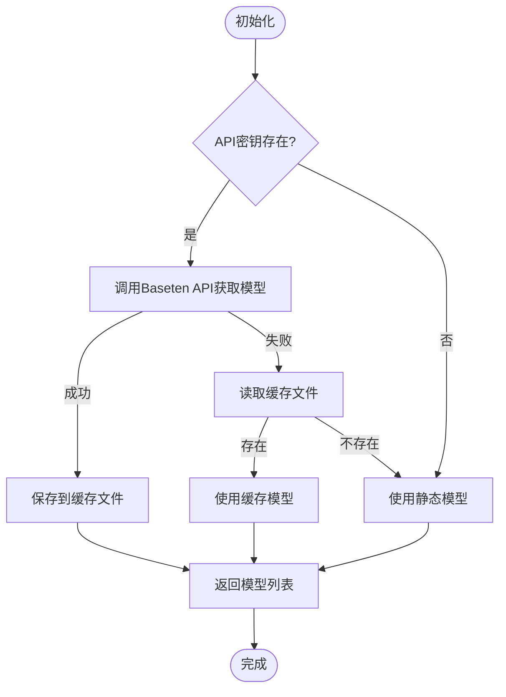

# 外部系统集成

<cite>
**本文档中引用的文件**  
- [baseten.ts](file://src/core/api/providers/baseten.ts) - *更新了Baseten模型的动态获取逻辑*
- [refreshBasetenModels.ts](file://src/core/controller/models/refreshBasetenModels.ts) - *新增了动态刷新Baseten模型的功能*
- [BasetenModelPicker.tsx](file://webview-ui/src/components/settings/BasetenModelPicker.tsx) - *UI组件，用于选择Baseten模型*
- [BasetenProvider.tsx](file://webview-ui/src/components/settings/providers/BasetenProvider.tsx) - *Baseten提供商配置组件*
- [anthropic.ts](file://src/core/api/providers/anthropic.ts)
- [types.ts](file://src/core/api/providers/types.ts)
- [hostbridge-grpc-service.ts](file://src/hosts/vscode/hostbridge-grpc-service.ts)
- [host-bridge-client-manager.ts](file://src/hosts/external/host-bridge-client-manager.ts)
- [BrowserSession.ts](file://src/services/browser/BrowserSession.ts)
- [TerminalManager.ts](file://src/integrations/terminal/TerminalManager.ts)
</cite>

## 更新摘要
**变更内容**  
- 更新了Baseten模型集成机制，从静态配置升级为动态获取
- 新增了`refreshBasetenModels`函数，支持通过API实时获取模型列表
- 增强了错误处理机制，包含缓存回退和详细的错误信息
- 更新了UI组件以支持动态模型列表显示
- 保留了静态模型作为后备方案，确保兼容性

## 目录
1. [简介](#简介)
2. [项目结构](#项目结构)
3. [核心组件](#核心组件)
4. [架构概述](#架构概述)
5. [详细组件分析](#详细组件分析)
6. [依赖分析](#依赖分析)
7. [性能考虑](#性能考虑)
8. [故障排除指南](#故障排除指南)
9. [结论](#结论)

## 简介
本文档旨在为将Cline集成到外部系统提供全面的指导。重点涵盖为新的大型语言模型（LLM）提供商添加API支持、与不同开发环境（如VS Code和外部宿主）的集成机制、与其他系统（如浏览器和终端）的交互方式，以及集成过程中可能遇到的挑战。特别关注Baseten提供商的最新动态模型获取功能。

## 项目结构
Cline的项目结构清晰地划分了不同功能模块，便于扩展和维护。核心功能位于`src`目录下，包括API提供商、宿主集成、服务和集成组件。

**图源**  
- [src/core/api/providers](file://src/core/api/providers)
- [src/hosts](file://src/hosts)
- [src/services](file://src/services)
- [src/integrations](file://src/integrations)

**本节来源**  
- [src/core/api/providers](file://src/core/api/providers)
- [src/hosts](file://src/hosts)
- [src/services](file://src/services)
- [src/integrations](file://src/integrations)

## 核心组件
Cline的核心组件包括API提供商、宿主桥接、浏览器服务和终端管理。这些组件共同实现了与外部系统的无缝集成。

**本节来源**  
- [src/core/api/providers/types.ts](file://src/core/api/providers/types.ts)
- [src/hosts/vscode/hostbridge-grpc-service.ts](file://src/hosts/vscode/hostbridge-grpc-service.ts)
- [src/services/browser/BrowserSession.ts](file://src/services/browser/BrowserSession.ts)
- [src/integrations/terminal/TerminalManager.ts](file://src/integrations/terminal/TerminalManager.ts)

## 架构概述
Cline的架构采用模块化设计，通过gRPC实现与宿主环境的通信，并通过独立的服务组件与外部系统交互。

**图源**  
- [src/hosts/vscode/hostbridge-grpc-service.ts](file://src/hosts/vscode/hostbridge-grpc-service.ts)
- [src/hosts/external/host-bridge-client-manager.ts](file://src/hosts/external/host-bridge-client-manager.ts)
- [src/services/browser/BrowserSession.ts](file://src/services/browser/BrowserSession.ts)
- [src/integrations/terminal/TerminalManager.ts](file://src/integrations/terminal/TerminalManager.ts)

## 详细组件分析

### 添加新的LLM提供商
要为新的LLM提供商添加支持，需要在`src/core/api/providers/`目录下创建一个新的提供者类，实现`BaseProvider`接口。

**图源**  
- [src/core/api/providers/types.ts](file://src/core/api/providers/types.ts)
- [src/core/api/providers/anthropic.ts](file://src/core/api/providers/anthropic.ts)

**本节来源**  
- [src/core/api/providers/types.ts](file://src/core/api/providers/types.ts)
- [src/core/api/providers/anthropic.ts](file://src/core/api/providers/anthropic.ts)

### 宿主集成机制
Cline通过`host-bridge-client`与宿主环境通信，使用gRPC协议实现高效的数据交换。

#### VS Code集成

**图源**  
- [src/hosts/vscode/hostbridge-grpc-service.ts](file://src/hosts/vscode/hostbridge-grpc-service.ts)

#### 外部宿主集成

**图源**  
- [src/hosts/external/host-bridge-client-manager.ts](file://src/hosts/external/host-bridge-client-manager.ts)

**本节来源**  
- [src/hosts/vscode/hostbridge-grpc-service.ts](file://src/hosts/vscode/hostbridge-grpc-service.ts)
- [src/hosts/external/host-bridge-client-manager.ts](file://src/hosts/external/host-bridge-client-manager.ts)

### 浏览器集成
通过`BrowserSession`类实现与浏览器的交互，支持本地和远程Chrome实例。

**图源**  
- [src/services/browser/BrowserSession.ts](file://src/services/browser/BrowserSession.ts)

### 终端集成
通过`TerminalManager`类管理终端会话，支持命令执行和输出处理。

**图源**  
- [src/integrations/terminal/TerminalManager.ts](file://src/integrations/terminal/TerminalManager.ts)

**本节来源**  
- [src/services/browser/BrowserSession.ts](file://src/services/browser/BrowserSession.ts)
- [src/integrations/terminal/TerminalManager.ts](file://src/integrations/terminal/TerminalManager.ts)

### Baseten模型动态获取
Baseten提供商现在支持通过API动态获取最新的模型列表，取代了之前的静态配置方式。

**图源**  
- [src/core/controller/models/refreshBasetenModels.ts](file://src/core/controller/models/refreshBasetenModels.ts)

**本节来源**  
- [src/core/controller/models/refreshBasetenModels.ts](file://src/core/controller/models/refreshBasetenModels.ts)
- [src/core/api/providers/baseten.ts](file://src/core/api/providers/baseten.ts)
- [webview-ui/src/components/settings/BasetenModelPicker.tsx](file://webview-ui/src/components/settings/BasetenModelPicker.tsx)

## 依赖分析
Cline的组件之间通过清晰的接口进行交互，降低了耦合度。

**图源**  
- [src/core/api/providers](file://src/core/api/providers)
- [src/hosts](file://src/hosts)
- [src/services](file://src/services)
- [src/integrations](file://src/integrations)

**本节来源**  
- [src/core/api/providers](file://src/core/api/providers)
- [src/hosts](file://src/hosts)
- [src/services](file://src/services)
- [src/integrations](file://src/integrations)

## 性能考虑
在集成过程中，需要考虑以下性能因素：
- gRPC通信的延迟
- 浏览器和终端操作的响应时间
- 大型语言模型API调用的耗时
- 数据序列化和反序列化的开销
- Baseten模型列表获取的网络延迟和缓存策略

## 故障排除指南
常见问题及解决方案：

**本节来源**  
- [src/services/browser/BrowserSession.ts](file://src/services/browser/BrowserSession.ts)
- [src/integrations/terminal/TerminalManager.ts](file://src/integrations/terminal/TerminalManager.ts)
- [src/core/controller/models/refreshBasetenModels.ts](file://src/core/controller/models/refreshBasetenModels.ts)

## 结论
Cline通过模块化设计和标准化接口，实现了与多种外部系统的灵活集成。开发者可以轻松添加新的LLM提供商，或将其集成到不同的开发环境中。Baseten提供商的动态模型获取功能增强了系统的灵活性和实时性，同时通过缓存和回退机制确保了可靠性。