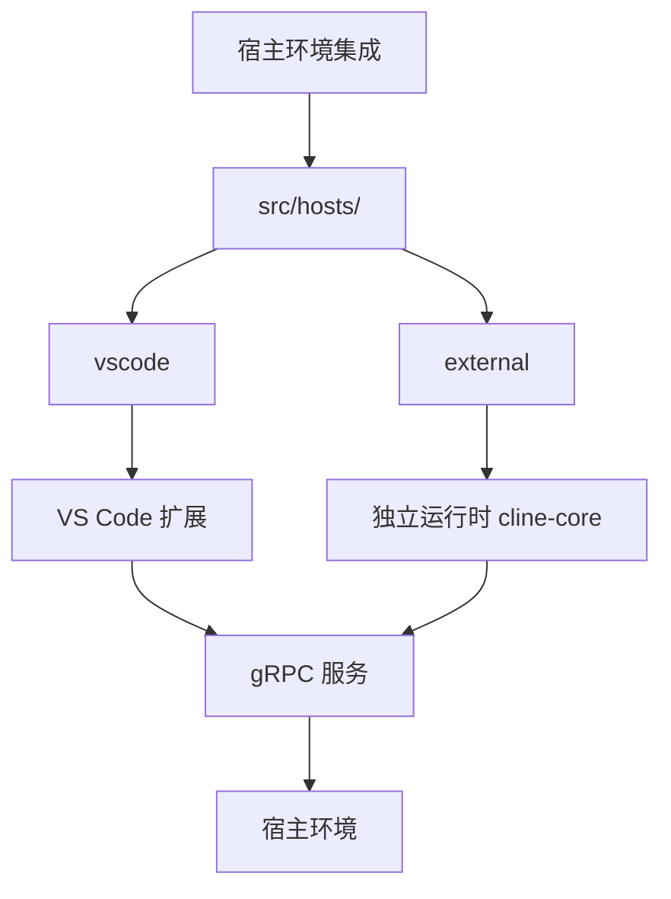
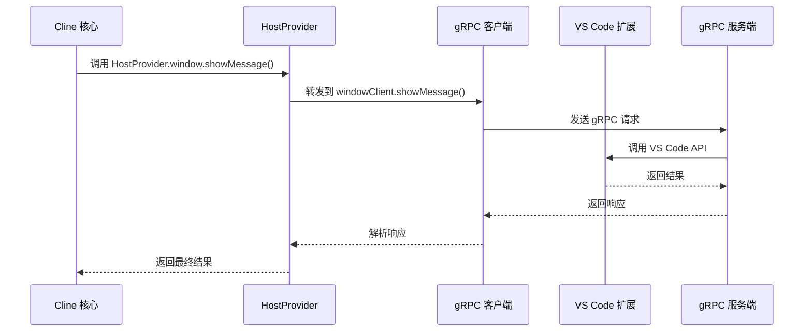
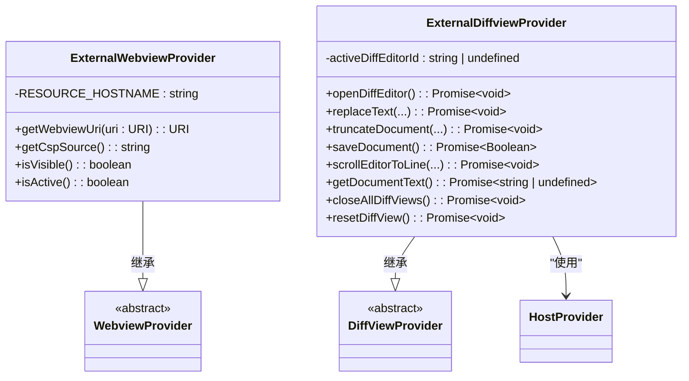
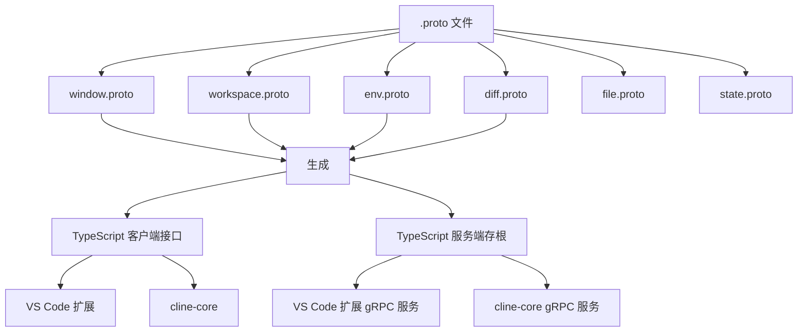
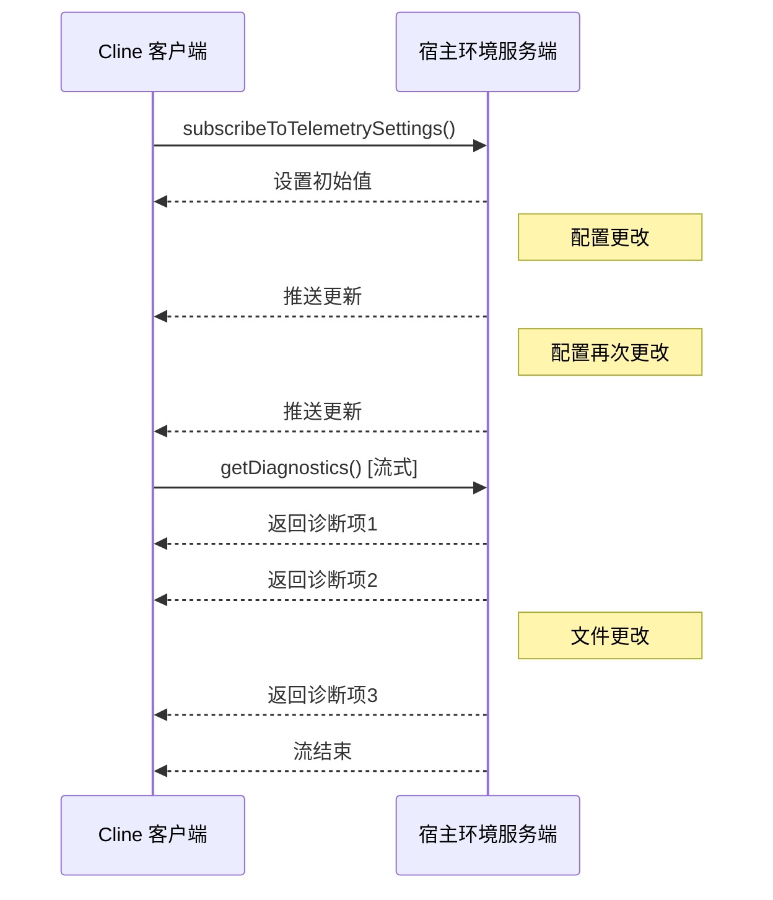

# 开发环境集成

<cite>
**本文档中引用的文件**
- [host-provider.ts](file://src/hosts/host-provider.ts)
- [host-grpc-client.ts](file://src/hosts/vscode/hostbridge/client/host-grpc-client.ts)
- [ExternalWebviewProvider.ts](file://src/hosts/external/ExternalWebviewProvider.ts)
- [ExternalDiffviewProvider.ts](file://src/hosts/external/ExternalDiffviewProvider.ts)
- [file.proto](file://proto/cline/file.proto)
- [window.proto](file://proto/host/window.proto)
- [workspace.proto](file://proto/host/workspace.proto)
</cite>

## 目录
1. [简介](#简介)
2. [宿主环境架构](#宿主环境架构)
3. [HostProvider 抽象接口](#hostprovider-抽象接口)
4. [VS Code gRPC 客户端实现](#vs-code-grpc-客户端实现)
5. [外部环境支持](#外部环境支持)
6. [gRPC 服务定义与协议驱动](#grpc-服务定义与协议驱动)
7. [双向通信与状态同步机制](#双向通信与状态同步机制)
8. [结论](#结论)

## 简介
本文档深入探讨 Cline 如何与不同开发环境（特别是 VS Code）集成。通过分析 `src/hosts/` 目录下的架构设计、`HostProvider` 抽象接口、gRPC 客户端实现以及外部环境支持机制，全面揭示 Cline 的跨平台集成能力。文档结合 `.proto` 文件定义，说明 gRPC 服务如何驱动整个集成架构，并讨论双向通信和状态同步的核心机制。

## 宿主环境架构

Cline 的宿主环境集成架构位于 `src/hosts/` 目录下，采用模块化设计以支持多种开发环境。该目录包含两个主要子目录：`vscode` 和 `external`，分别服务于不同的运行时环境。

- `vscode` 子目录包含专为 Visual Studio Code 扩展设计的实现，利用 VS Code 的 API 提供深度集成。
- `external` 子目录则面向非 VS Code 环境（如独立运行的 `cline-core`），通过标准化的 gRPC 接口与宿主环境通信。

这种分离设计使得核心逻辑保持平台无关性，同时允许针对特定环境进行优化和定制。



**Diagram sources**
- [src/hosts/](file://src/hosts/)

**Section sources**
- [src/hosts/](file://src/hosts/)

## HostProvider 抽象接口

`HostProvider` 是 Cline 集成架构中的核心抽象层，定义了与宿主环境交互的契约。它采用单例模式确保全局唯一实例，通过依赖注入机制为上层代码提供平台无关的宿主服务访问能力。

该接口主要包含以下组成部分：
- `createWebviewProvider`：创建 Webview 提供者实例的工厂函数
- `createDiffViewProvider`：创建 Diff View 提供者实例的工厂函数
- `hostBridge`：提供对 gRPC 客户端的访问，用于与宿主环境通信
- `logToChannel`：向用户可见的输出通道写入日志
- `getCallbackUri`：获取重定向到 Cline 的回调 URI
- `getBinaryLocation`：获取指定二进制文件的位置

通过静态属性 `workspace`、`env`、`window` 和 `diff`，开发者可以便捷地访问对应的 gRPC 客户端，实现对工作区、环境、窗口和 diff 操作的控制。

```mermaid
classDiagram
class HostProvider {
-instance : HostProvider
+createWebviewProvider : WebviewProviderCreator
+createDiffViewProvider : DiffViewProviderCreator
+hostBridge : HostBridgeClientProvider
+logToChannel : LogToChannel
+getCallbackUri() : Promise~string~
+getBinaryLocation(name : string) : Promise~string~
+initialize(...) : HostProvider
+get() : HostProvider
+isInitialized() : boolean
+reset() : void
+workspace : WorkspaceClient
+env : EnvClient
+window : WindowClient
+diff : DiffClient
}
class WebviewProviderCreator {
<<type>>
(providerType : WebviewProviderType) => WebviewProvider
}
class DiffViewProviderCreator {
<<type>>
() => DiffViewProvider
}
class HostBridgeClientProvider {
<<interface>>
+workspaceClient : WorkspaceServiceClient
+envClient : EnvServiceClient
+windowClient : WindowServiceClient
+diffClient : DiffServiceClient
}
HostProvider --> WebviewProviderCreator : "使用"
HostProvider --> DiffViewProviderCreator : "使用"
HostProvider --> HostBridgeClientProvider : "包含"
```

**Diagram sources**
- [host-provider.ts](file://src/hosts/host-provider.ts#L18-L113)

**Section sources**
- [host-provider.ts](file://src/hosts/host-provider.ts#L1-L126)

## VS Code gRPC 客户端实现

在 `src/hosts/vscode/hostbridge/` 目录下，Cline 实现了与 VS Code 扩展通信的 gRPC 客户端。该实现基于 `host-grpc-client.ts` 文件中的 `vscodeHostBridgeClient` 对象，通过 `createGrpcClient` 工具函数创建各个服务的客户端实例。

gRPC 客户端与 VS Code 扩展中的 gRPC 服务端建立连接，处理来自 Cline 核心的请求。主要功能包括：
- **文件操作**：通过 `workspace` 服务查询工作区路径、获取诊断信息等
- **窗口管理**：通过 `window` 服务显示消息框、打开文件、获取活动编辑器等
- **环境信息**：通过 `env` 服务读写剪贴板、获取机器 ID 等
- **Diff 操作**：通过 `diff` 服务打开 diff 编辑器、替换文本、保存文档等

每个服务的实现都位于独立的子目录中（如 `window/`、`workspace/`），保持代码的模块化和可维护性。客户端通过异步方法调用与服务端通信，确保 UI 线程不被阻塞。



**Diagram sources**
- [host-grpc-client.ts](file://src/hosts/vscode/hostbridge/client/host-grpc-client.ts#L1-L10)
- [src/hosts/vscode/hostbridge/window/](file://src/hosts/vscode/hostbridge/window/)
- [src/hosts/vscode/hostbridge/workspace/](file://src/hosts/vscode/hostbridge/workspace/)

**Section sources**
- [host-grpc-client.ts](file://src/hosts/vscode/hostbridge/client/host-grpc-client.ts#L1-L10)

## 外部环境支持

对于非 VS Code 环境，Cline 通过 `src/hosts/external/` 目录下的实现提供支持。`ExternalWebviewProvider` 和 `ExternalDiffviewProvider` 是两个关键类，它们分别处理 Webview 和 Diff View 的展示与交互。

`ExternalWebviewProvider` 重写了 `getWebviewUri` 和 `getCspSource` 方法，将本地文件 URI 转换为 HTTPS URI，确保在外部环境中安全加载资源。它还实现了 `isVisible` 和 `isActive` 方法，为外部环境提供必要的状态信息。

`ExternalDiffviewProvider` 则通过 `HostProvider.diff` 客户端与宿主环境通信，实现 diff 编辑器的打开、文本替换、文档保存等功能。它维护了一个 `activeDiffEditorId` 来跟踪当前活动的 diff 编辑器，并在操作失败时进行适当的错误处理（如忽略 `NOT_FOUND` 错误）。

这些实现使得 Cline 能够在没有 VS Code API 的环境中正常运行，为用户提供一致的功能体验。



**Diagram sources**
- [ExternalWebviewProvider.ts](file://src/hosts/external/ExternalWebviewProvider.ts#L5-L28)
- [ExternalDiffviewProvider.ts](file://src/hosts/external/ExternalDiffviewProvider.ts#L4-L92)

**Section sources**
- [ExternalWebviewProvider.ts](file://src/hosts/external/ExternalWebviewProvider.ts#L1-L29)
- [ExternalDiffviewProvider.ts](file://src/hosts/external/ExternalDiffviewProvider.ts#L1-L93)

## gRPC 服务定义与协议驱动

Cline 的集成架构由 `proto/` 目录下的 `.proto` 文件驱动。这些协议缓冲区文件定义了 gRPC 服务的接口和消息格式，是跨平台通信的基础。

`proto/host/` 目录包含宿主环境相关的服务定义，如：
- `window.proto`：定义窗口管理操作（显示消息、打开文件等）
- `workspace.proto`：定义工作区操作（获取路径、诊断信息等）
- `env.proto`：定义环境信息操作（剪贴板、机器 ID 等）
- `diff.proto`：定义 diff 操作（打开 diff、替换文本等）

`proto/cline/` 目录则包含 Cline 核心服务的定义，如 `file.proto`、`state.proto` 等。这些 `.proto` 文件通过 `scripts/generate-host-bridge-client.mjs` 脚本生成 TypeScript 客户端接口和实现，确保类型安全和代码一致性。

这种基于协议的设计使得 Cline 能够轻松支持新的宿主环境，只需实现相应的 gRPC 服务即可。



**Diagram sources**
- [window.proto](file://proto/host/window.proto)
- [workspace.proto](file://proto/host/workspace.proto)
- [file.proto](file://proto/cline/file.proto)

**Section sources**
- [proto/host/](file://proto/host/)
- [proto/cline/](file://proto/cline/)

## 双向通信与状态同步机制

Cline 采用双向 gRPC 流实现高效的通信和状态同步。除了常规的请求-响应模式外，系统还支持服务器端推送更新，确保客户端状态与宿主环境保持同步。

例如，`env.proto` 中的 `subscribeToTelemetrySettings` 方法允许客户端订阅遥测设置的变化，当设置更新时，服务器会主动推送新值。类似地，`workspace.proto` 中的诊断信息也可以通过流式响应实时更新。

状态同步通过 `HostProvider` 单例管理，确保整个应用使用一致的状态视图。当从 gRPC 服务接收到更新时，`HostProvider` 会通知所有监听者，触发 UI 更新或其他响应动作。

这种机制减少了轮询带来的性能开销，提高了用户体验的实时性和响应性。



**Diagram sources**
- [env.proto](file://proto/host/env.proto)
- [workspace.proto](file://proto/host/workspace.proto)

**Section sources**
- [host-provider.ts](file://src/hosts/host-provider.ts#L1-L126)

## 结论
Cline 通过精心设计的 `src/hosts/` 架构实现了与不同开发环境的无缝集成。`HostProvider` 抽象接口提供了统一的访问点，gRPC 客户端实现了与 VS Code 扩展的高效通信，而外部环境支持类则确保了在非 VS Code 环境中的功能完整性。基于 `.proto` 文件的协议驱动设计使得系统具有良好的扩展性和类型安全性，双向通信机制则保证了状态的实时同步。这一集成架构为 Cline 的跨平台能力奠定了坚实的基础。