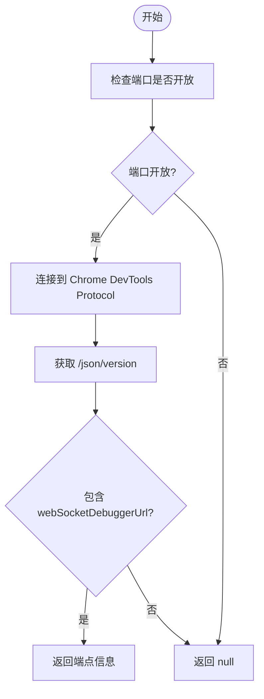
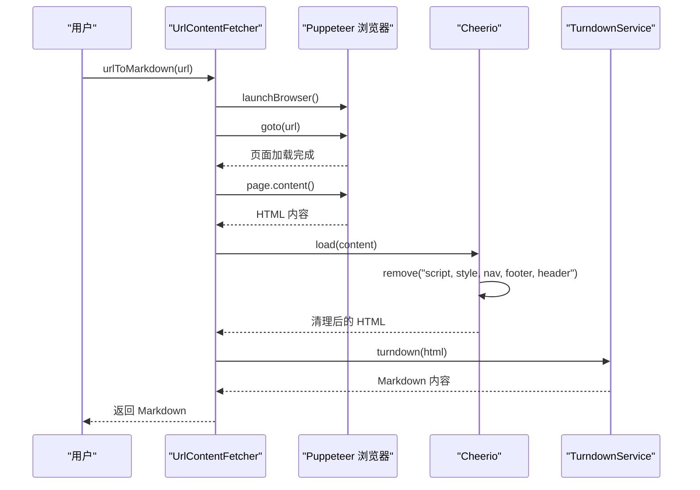

# 浏览器集成

<cite>
**本文档中引用的文件**  
- [BrowserDiscovery.ts](file://src/services/browser/BrowserDiscovery.ts)
- [BrowserSession.ts](file://src/services/browser/BrowserSession.ts)
- [UrlContentFetcher.ts](file://src/services/browser/UrlContentFetcher.ts)
- [discoverBrowser.ts](file://src/core/controller/browser/discoverBrowser.ts)
- [testBrowserConnection.ts](file://src/core/controller/browser/testBrowserConnection.ts)
- [getBrowserConnectionInfo.ts](file://src/core/controller/browser/getBrowserConnectionInfo.ts)
- [getDetectedChromePath.ts](file://src/core/controller/browser/getDetectedChromePath.ts)
- [relaunchChromeDebugMode.ts](file://src/core/controller/browser/relaunchChromeDebugMode.ts)
- [DiffViewProvider.ts](file://src/integrations/editor/DiffViewProvider.ts)
</cite>

## 目录
1. [简介](#简介)
2. [核心服务](#核心服务)
3. [控制器函数](#控制器函数)
4. [代码差异查看支持](#代码差异查看支持)
5. [端到端使用场景](#端到端使用场景)
6. [安全与性能](#安全与性能)
7. [结论](#结论)

## 简介
Cline 浏览器集成功能允许用户在无头浏览器环境中加载、操作和提取网页内容。该功能通过一系列核心服务和控制器实现，支持本地和远程 Chrome 实例的检测与连接，并提供在编辑器中查看代码差异的能力。本指南将详细介绍这些组件的工作原理和使用方法。

## 核心服务

### BrowserDiscovery 服务
`BrowserDiscovery` 服务负责检测本地运行的 Chrome 实例。它通过尝试连接到 `localhost` 和 `127.0.0.1` 的 9222 端口（Chrome 的默认调试端口）来发现可用的浏览器实例。该服务使用 `axios` 发送 HTTP 请求到 `/json/version` 端点，以获取 WebSocket 调试 URL。如果连接成功，返回包含端点信息的对象；否则返回 `null`。



**Diagram sources**
- [BrowserDiscovery.ts](file://src/services/browser/BrowserDiscovery.ts#L1-L102)

**Section sources**
- [BrowserDiscovery.ts](file://src/services/browser/BrowserDiscovery.ts#L1-L102)

### BrowserSession 服务
`BrowserSession` 类管理与无头浏览器的连接和会话。它支持本地和远程两种模式：
- **本地模式**：使用 Puppeteer 启动一个无头 Chrome 实例，用于自动化任务。
- **远程模式**：连接到已运行且启用了远程调试的 Chrome 实例。

该服务提供了导航、点击、输入、滚动等操作方法，并通过 `doAction` 方法封装了错误处理和日志记录。会话结束后，可以调用 `closeBrowser` 方法清理资源。

```mermaid
classDiagram
class BrowserSession {
-context : vscode.ExtensionContext
-browser : Browser
-page : Page
-browserSettings : BrowserSettings
+launchBrowser() : Promise~void~
+closeBrowser() : Promise~BrowserActionResult~
+navigateToUrl(url : string) : Promise~BrowserActionResult~
+click(coordinate : string) : Promise~BrowserActionResult~
+type(text : string) : Promise~BrowserActionResult~
+scrollDown() : Promise~BrowserActionResult~
+scrollUp() : Promise~BrowserActionResult~
}
class BrowserDiscovery {
+discoverChromeInstances() : Promise~string | null~
+testBrowserConnection(host : string) : Promise~{ success : boolean; message : string; endpoint? : string }~
}
BrowserSession --> BrowserDiscovery : "使用"
```

**Diagram sources**
- [BrowserSession.ts](file://src/services/browser/BrowserSession.ts#L1-L636)

**Section sources**
- [BrowserSession.ts](file://src/services/browser/BrowserSession.ts#L1-L636)

### UrlContentFetcher 服务
`UrlContentFetcher` 服务在浏览器环境中加载网页并提取内容。它使用 Puppeteer 启动一个浏览器实例，导航到指定 URL，等待页面加载完成，然后使用 Cheerio 解析和清理 HTML 内容（移除脚本、样式等非必要元素），最后通过 TurndownService 将清理后的 HTML 转换为 Markdown 格式。



**Diagram sources**
- [UrlContentFetcher.ts](file://src/services/browser/UrlContentFetcher.ts#L1-L96)

**Section sources**
- [UrlContentFetcher.ts](file://src/services/browser/UrlContentFetcher.ts#L1-L96)

## 控制器函数

### discoverBrowser
`discoverBrowser` 控制器函数作为 UI 与底层服务之间的桥梁，调用 `BrowserDiscovery` 服务来发现本地 Chrome 实例。如果发现实例，它会测试连接并返回包含 WebSocket 端点的连接信息；否则返回失败消息。

**Section sources**
- [discoverBrowser.ts](file://src/core/controller/browser/discoverBrowser.ts#L1-L46)

### testBrowserConnection
`testBrowserConnection` 函数测试与指定主机的浏览器连接。如果未提供主机地址，它会尝试自动发现本地 Chrome 实例。该函数使用 `BrowserSession` 的 `testConnection` 方法进行实际的连接测试。

**Section sources**
- [testBrowserConnection.ts](file://src/core/controller/browser/testBrowserConnection.ts#L1-L62)

### getBrowserConnectionInfo
`getBrowserConnectionInfo` 函数获取当前浏览器连接的状态信息。它首先检查是否存在活动的浏览器会话，如果有，则返回会话的连接信息；否则，根据浏览器设置返回连接状态。

**Section sources**
- [getBrowserConnectionInfo.ts](file://src/core/controller/browser/getBrowserConnectionInfo.ts#L1-L46)

### getDetectedChromePath
`getDetectedChromePath` 函数获取检测到的 Chrome 可执行文件路径。它按照优先级顺序检查：用户设置的路径、系统安装的 Chrome、Puppeteer 捆绑的 Chrome。

**Section sources**
- [getDetectedChromePath.ts](file://src/core/controller/browser/getDetectedChromePath.ts#L1-L29)

### relaunchChromeDebugMode
`relaunchChromeDebugMode` 函数以调试模式重新启动 Chrome。它使用 `chrome-launcher` 库找到 Chrome 安装路径，并以 `--remote-debugging-port=9222` 参数启动一个新的进程。

**Section sources**
- [relaunchChromeDebugMode.ts](file://src/core/controller/browser/relaunchChromeDebugMode.ts#L1-L25)

## 代码差异查看支持
`DiffViewProvider` 是一个抽象类，为在编辑器中查看代码差异提供支持。它负责打开差异编辑器、流式更新内容、处理用户编辑和保存更改。子类需要实现具体的编辑器操作方法，如 `openDiffEditor`、`scrollEditorToLine` 等。

该类在保存更改时会检测新出现的诊断问题（如编译错误），并将这些信息反馈给模型，以便及时修复。它还处理了 BOM 字符、行尾符差异和自动格式化编辑，确保差异比较的准确性。

**Section sources**
- [DiffViewProvider.ts](file://src/integrations/editor/DiffViewProvider.ts#L1-L389)

## 端到端使用场景
用户可以通过以下步骤使用 Cline 的浏览器功能：

1. **启动浏览器**：用户通过 UI 触发浏览器启动。Cline 首先尝试连接到远程 Chrome 实例（如果启用），否则启动本地无头浏览器。
2. **导航到 URL**：用户指定目标 URL，Cline 调用 `navigateToUrl` 方法加载页面，并等待 DOM 内容加载和网络活动稳定。
3. **执行操作**：用户可以执行点击、输入、滚动等操作。每个操作都被记录并用于性能分析。
4. **获取结果**：操作完成后，Cline 截取页面截图并收集控制台日志，将这些结果返回给用户。

例如，用户可以让 Cline 导航到一个文档网站，搜索特定内容，然后提取相关信息。

## 安全与性能

### 安全考虑
- **沙箱**：本地无头浏览器在沙箱环境中运行，限制了对系统资源的访问。
- **远程调试**：远程连接需要显式启用 `--remote-debugging-port` 参数，增加了安全性。
- **权限控制**：所有浏览器操作都经过用户确认，防止未经授权的访问。

### 性能优化
- **缓存**：`BrowserSession` 缓存了 WebSocket 端点，避免重复连接。
- **资源管理**：浏览器实例在会话结束后被正确关闭，释放系统资源。
- **超时机制**：所有网络请求和页面操作都设置了合理的超时时间，防止无限等待。

## 结论
Cline 的浏览器集成提供了一套完整的工具，用于自动化网页交互和内容提取。通过核心服务、控制器和差异查看器的协同工作，用户可以高效地完成复杂的浏览器任务。未来可以进一步优化性能，例如实现更智能的页面加载等待策略和更高效的资源复用机制。