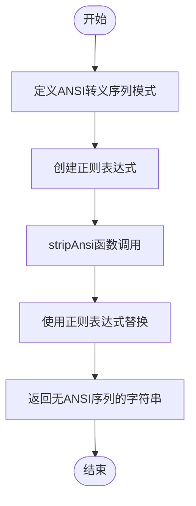
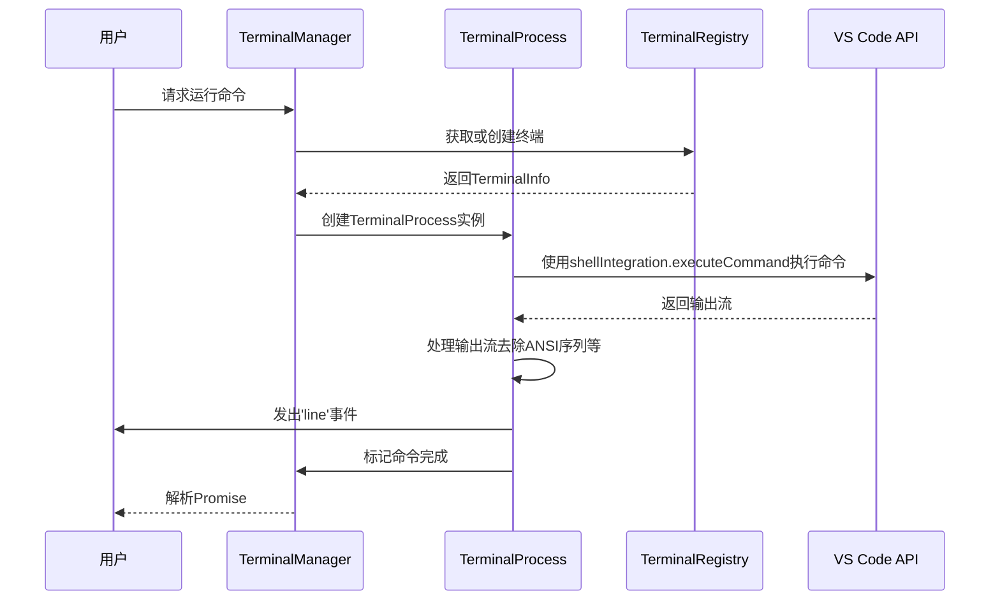
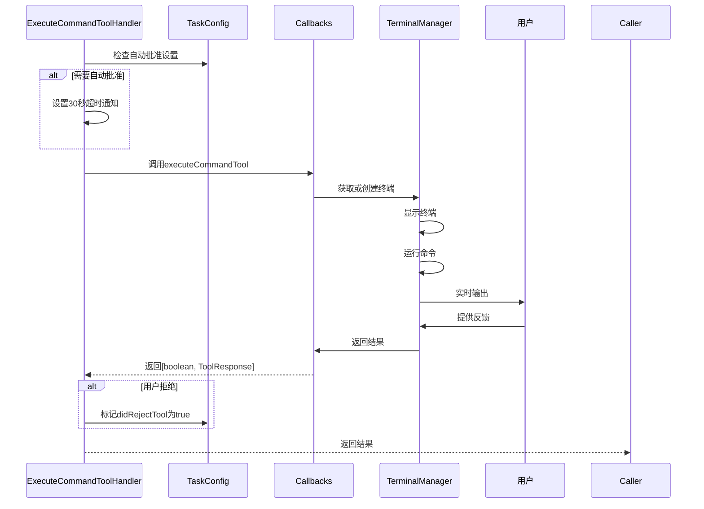

# 终端集成

<cite>
**本文档引用的文件**  
- [TerminalManager.ts](file://src/integrations/terminal/TerminalManager.ts)
- [TerminalProcess.ts](file://src/integrations/terminal/TerminalProcess.ts)
- [TerminalRegistry.ts](file://src/integrations/terminal/TerminalRegistry.ts)
- [ansiUtils.ts](file://src/integrations/terminal/ansiUtils.ts)
- [get-latest-output.ts](file://src/integrations/terminal/get-latest-output.ts)
- [enhanced-terminal.js](file://standalone/runtime-files/vscode/enhanced-terminal.js)
- [ExecuteCommandToolHandler.ts](file://src/core/task/tools/handlers/ExecuteCommandToolHandler.ts)
- [index.ts](file://src/core/task/index.ts)
</cite>

## 目录
1. [简介](#简介)
2. [核心组件](#核心组件)
3. [终端管理与会话控制](#终端管理与会话控制)
4. [ANSI转义序列处理](#ansi转义序列处理)
5. [终端输出提取机制](#终端输出提取机制)
6. VS Code环境脚本注入
7. 命令执行与用户授权
8. 结论

## 简介
Cline的终端集成功能旨在通过VS Code的shell集成API实现对终端会话的高效创建、管理和监控。该系统不仅支持实时输出处理和命令执行，还确保了用户对所有操作的明确授权。通过`TerminalManager`、`TerminalProcess`等核心组件，Cline能够灵活地运行命令，并在必要时继续后台执行。此外，`ansiUtils.ts`用于解析和渲染来自终端的ANSI转义序列，而`get-latest-output.ts`则提供了从终端会话中提取信息的能力。`enhanced-terminal.js`在VS Code环境中注入脚本以增强终端功能。最后，`executeCommandToolHandler`负责执行命令、处理输出、检测命令完成，并确保用户授权。

## 核心组件

Cline的终端集成依赖于多个关键组件，包括`TerminalManager`、`TerminalProcess`、`TerminalRegistry`、`ansiUtils`以及`get-latest-output`工具。这些组件共同协作，实现了终端会话的创建、管理、输出处理和信息提取。

**Section sources**
- [TerminalManager.ts](file://src/integrations/terminal/TerminalManager.ts#L1-L461)
- [TerminalProcess.ts](file://src/integrations/terminal/TerminalProcess.ts#L1-L314)
- [TerminalRegistry.ts](file://src/integrations/terminal/TerminalRegistry.ts#L1-L81)
- [ansiUtils.ts](file://src/integrations/terminal/ansiUtils.ts#L1-L14)
- [get-latest-output.ts](file://src/integrations/terminal/get-latest-output.ts#L1-L46)

## 终端管理与会话控制

### TerminalManager与TerminalProcess
`TerminalManager`负责创建或复用终端，并通过`runCommand()`方法运行命令，返回一个`TerminalProcess`实例。`TerminalProcess`继承自`EventEmitter`并实现了Promise接口，允许在命令执行期间发出'line'事件，同时支持等待完成或继续后台执行。

```mermaid
classDiagram
class TerminalManager {
+terminalIds : Set<number>
+processes : Map<number, TerminalProcess>
+disposables : Disposable[]
+shellIntegrationTimeout : number
+terminalReuseEnabled : boolean
+terminalOutputLineLimit : number
+defaultTerminalProfile : string
+constructor()
+runCommand(terminalInfo : TerminalInfo, command : string) : TerminalProcessResultPromise
+getOrCreateTerminal(cwd : string) : Promise<TerminalInfo>
+getTerminals(busy : boolean) : { id : number; lastCommand : string }[]
+getUnretrievedOutput(terminalId : number) : string
+isProcessHot(terminalId : number) : boolean
+disposeAll() : void
+setShellIntegrationTimeout(timeout : number) : void
+setTerminalReuseEnabled(enabled : boolean) : void
+setTerminalOutputLineLimit(limit : number) : void
+processOutput(outputLines : string[]) : string
+setDefaultTerminalProfile(profileId : string) : { closedCount : number; busyTerminals : TerminalInfo[] }
+filterTerminals(filterFn : (terminal : TerminalInfo) => boolean) : TerminalInfo[]
+closeTerminals(filterFn : (terminal : TerminalInfo) => boolean, force : boolean = false) : number
+handleTerminalProfileChange(newShellPath : string | undefined) : { closedCount : number; busyTerminals : TerminalInfo[] }
+closeAllTerminals() : number
}
class TerminalProcess {
+waitForShellIntegration : boolean
+isListening : boolean
+buffer : string
+fullOutput : string
+lastRetrievedIndex : number
+isHot : boolean
+hotTimer : NodeJS.Timeout | null
+run(terminal : vscode.Terminal, command : string) : Promise<void>
+emitIfEol(chunk : string) : void
+emitRemainingBufferIfListening() : void
+continue() : void
+getUnretrievedOutput() : string
+removeLastLineArtifacts(output : string) : string
}
class TerminalInfo {
+terminal : vscode.Terminal
+busy : boolean
+lastCommand : string
+id : number
+shellPath? : string
+lastActive : number
+pendingCwdChange? : string
+cwdResolved? : { resolve : () => void; reject : (error : Error) => void }
}
class TerminalRegistry {
-terminals : TerminalInfo[]
-nextTerminalId : number
+createTerminal(cwd? : string | vscode.Uri | undefined, shellPath? : string) : TerminalInfo
+getTerminal(id : number) : TerminalInfo | undefined
+updateTerminal(id : number, updates : Partial<TerminalInfo>) : void
+removeTerminal(id : number) : void
+getAllTerminals() : TerminalInfo[]
-isTerminalClosed(terminal : vscode.Terminal) : boolean
}
TerminalManager --> TerminalProcess : "创建"
TerminalManager --> TerminalRegistry : "使用"
TerminalProcess --> TerminalInfo : "关联"
TerminalRegistry --> TerminalInfo : "管理"
```

**Diagram sources**
- [TerminalManager.ts](file://src/integrations/terminal/TerminalManager.ts#L1-L461)
- [TerminalProcess.ts](file://src/integrations/terminal/TerminalProcess.ts#L1-L314)
- [TerminalRegistry.ts](file://src/integrations/terminal/TerminalRegistry.ts#L1-L81)

### TerminalRegistry
`TerminalRegistry`用于跟踪所有活动的终端实例。由于VS Code API无法直接判断终端是否繁忙，`TerminalRegistry`通过维护一个内部列表来记录终端的状态，包括是否忙碌、最后执行的命令等。这有助于防止创建过多的终端实例，并确保任务生命周期内的终端复用。

**Section sources**
- [TerminalRegistry.ts](file://src/integrations/terminal/TerminalRegistry.ts#L1-L81)

## ANSI转义序列处理

`ansiUtils.ts`模块提供了处理ANSI转义序列的功能，确保终端输出能够正确渲染。它包含两个主要函数：`ansiRegex()`生成匹配ANSI转义序列的正则表达式，`stripAnsi()`则利用此正则表达式移除字符串中的ANSI转义序列。



**Diagram sources**
- [ansiUtils.ts](file://src/integrations/terminal/ansiUtils.ts#L1-L14)

## 终端输出提取机制

`get-latest-output.ts`中的`getLatestTerminalOutput()`函数负责从当前活动的终端中获取内容。该函数首先选择并复制终端的所有内容到剪贴板，然后读取剪贴板内容作为终端输出。为了保证原始剪贴板内容不被破坏，函数会在最后恢复原始内容。



**Diagram sources**
- [get-latest-output.ts](file://src/integrations/terminal/get-latest-output.ts#L1-L46)

## VS Code环境脚本注入

`standalone/runtime-files/vscode/enhanced-terminal.js`文件的作用是在VS Code环境中注入脚本以增强终端功能。这个脚本实现了独立的终端管理器`StandaloneTerminalManager`，它可以创建、管理和监控终端会话，即使在没有VS Code shell集成API的情况下也能正常工作。此脚本还定义了`StandaloneTerminal`、`StandaloneTerminalProcess`和`StandaloneTerminalRegistry`类，提供了完整的终端生命周期管理能力。

```mermaid
classDiagram
class StandaloneTerminalManager {
+registry : StandaloneTerminalRegistry
+processes : Map<number, StandaloneTerminalProcess>
+terminalIds : Set<number>
+shellIntegrationTimeout : number
+terminalReuseEnabled : boolean
+terminalOutputLineLimit : number
+defaultTerminalProfile : string
+runCommand(terminalInfo : TerminalInfo, command : string) : TerminalProcessResultPromise
+getOrCreateTerminal(cwd : string) : Promise<TerminalInfo>
+getTerminals(busy : boolean) : { id : number; lastCommand : string }[]
+getUnretrievedOutput(terminalId : number) : string
+isProcessHot(terminalId : number) : boolean
+processOutput(outputLines : string[]) : string
+disposeAll() : void
+setShellIntegrationTimeout(timeout : number) : void
+setTerminalReuseEnabled(enabled : boolean) : void
+setTerminalOutputLineLimit(limit : number) : void
+setDefaultTerminalProfile(profileId : string) : void
+mergePromise(process : StandaloneTerminalProcess, promise : Promise<void>) : TerminalProcessResultPromise
}
class StandaloneTerminalProcess {
+waitForShellIntegration : boolean
+isListening : boolean
+buffer : string
+fullOutput : string
+lastRetrievedIndex : number
+isHot : boolean
+hotTimer : NodeJS.Timeout | null
+childProcess : ChildProcess | null
+exitCode : number | null
+isCompleted : boolean
+run(terminal : StandaloneTerminal, command : string) : Promise<void>
+handleOutput(data : string, didEmitEmptyLine : boolean) : void
+emitLines(chunk : string) : void
+emitRemainingBuffer() : void
+continue() : void
+getUnretrievedOutput() : string
+removeLastLineArtifacts(output : string) : string
+getDefaultShell() : string
+getShellArgs(shell : string, command : string) : string[]
+terminate() : void
}
class StandaloneTerminal {
+name : string
+processId : Promise<number>
+creationOptions : any
+exitStatus : undefined | { reason : string }
+state : { isInteractedWith : boolean }
+_cwd : string
+_shellPath : string | undefined
+_process : ChildProcess | null
+_processId : number | null
+shellIntegration : { cwd : { fsPath : string }, executeCommand : (command : string) => { read : AsyncGenerator<string> } }
+sendText(text : string, addNewLine : boolean) : void
+show() : void
+hide() : void
+dispose() : void
}
class StandaloneTerminalRegistry {
+terminals : Map<number, TerminalInfo>
+nextId : number
+createTerminal(options : any) : TerminalInfo
+getTerminal(id : number) : TerminalInfo | undefined
+getAllTerminals() : TerminalInfo[]
+removeTerminal(id : number) : void
+updateTerminal(id : number, updates : Partial<TerminalInfo>) : void
}
StandaloneTerminalManager --> StandaloneTerminalProcess : "创建"
StandaloneTerminalManager --> StandaloneTerminalRegistry : "使用"
StandaloneTerminalProcess --> StandaloneTerminal : "关联"
StandaloneTerminalRegistry --> TerminalInfo : "管理"
```

**Diagram sources**
- [enhanced-terminal.js](file://standalone/runtime-files/vscode/enhanced-terminal.js#L1-L517)

## 命令执行与用户授权

### executeCommandToolHandler
`ExecuteCommandToolHandler`是处理命令执行的核心组件之一。它通过`handlePartialBlock`方法接收命令请求，检查是否需要自动批准，设置超时通知，并最终调用`config.callbacks.executeCommandTool(command)`来执行命令。如果用户拒绝了命令，则标记任务状态为已拒绝。



**Diagram sources**
- [ExecuteCommandToolHandler.ts](file://src/core/task/tools/handlers/ExecuteCommandToolHandler.ts#L1-L134)

### 命令执行流程
当执行命令时，`Task`类中的`executeCommandTool`方法会根据当前模式决定是在Node环境中直接执行还是通过终端执行。如果是通过终端执行，它会获取或创建一个终端，显示终端窗口，并启动命令执行过程。过程中会缓冲输出，定期向用户询问是否继续处理，直到命令完成或用户干预。

**Section sources**
- [index.ts](file://src/core/task/index.ts#L1064-L1263)

## 结论
Cline的终端集成功能通过一系列精心设计的组件实现了强大的终端管理能力。从`TerminalManager`和`TerminalProcess`的协同工作，到`TerminalRegistry`对终端实例的跟踪，再到`ansiUtils`对ANSI转义序列的处理，每一个环节都体现了对细节的关注。`get-latest-output`工具确保了即使在复杂情况下也能准确提取终端输出。`enhanced-terminal.js`的引入进一步增强了在不同环境下的兼容性和功能性。最后，通过`executeCommandToolHandler`和相关回调机制，Cline确保了所有命令执行都有明确的用户授权，从而保障了系统的安全性和可靠性。