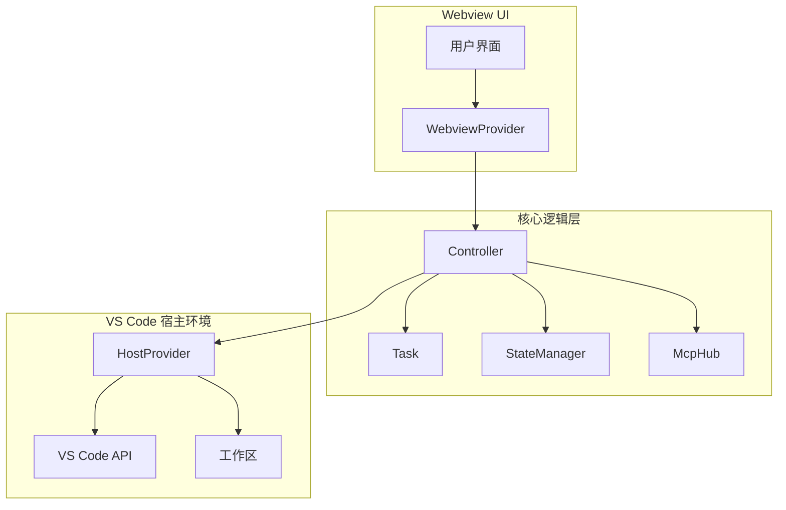

# 项目概述

<cite>
**本文档引用的文件**  
- [README.md](file://README.md)
- [extension.ts](file://src/extension.ts)
- [WebviewProvider.ts](file://src/core/webview/WebviewProvider.ts)
- [controller/index.ts](file://src/core/controller/index.ts)
- [task/index.ts](file://src/core/task/index.ts)
</cite>

## 目录
1. [简介](#简介)
2. [核心价值与定位](#核心价值与定位)
3. [目标用户](#目标用户)
4. [主要功能特性](#主要功能特性)
5. [系统架构概览](#系统架构概览)
6. [使用场景示例](#使用场景示例)
7. [技术深度解析](#技术深度解析)
8. [总结](#总结)

## 简介

Cline 是一款专为 Visual Studio Code 设计的 AI 助手扩展，旨在通过整合命令行、代码编辑器和浏览器功能，实现复杂软件开发任务的自动化。该工具利用 Claude Sonnet 的智能编码能力，能够逐步处理复杂的开发任务，从文件创建与编辑到终端命令执行，再到浏览器交互调试，全面覆盖现代软件开发流程。

Cline 的设计哲学是“人在环路中”（human-in-the-loop），即所有文件更改和终端命令都需要用户确认，确保了自动化过程的安全性和可控性。同时，它支持 Model Context Protocol (MCP) 协议，允许动态扩展其功能，创建定制化工具以适应不同工作流需求。

本概述文档将详细介绍 Cline 的核心使命、功能特性、系统架构以及典型使用场景，帮助开发者快速理解并上手使用这一强大的开发辅助工具。

**Section sources**
- [README.md](file://README.md#L1-L147)

## 核心价值与定位

Cline 的核心价值在于将 AI 智能体的能力无缝集成到开发者的日常编码环境中。它不仅仅是一个代码补全工具或技术问答助手，而是能够主动分析项目结构、执行多步骤任务、与外部系统交互的智能代理。

其定位是成为开发者在 VS Code 中的“数字同事”，能够在用户授权下完成以下任务：
- 分析项目文件结构和源代码抽象语法树（AST）
- 创建和编辑文件，并监控编译器/检查器错误
- 在终端中执行命令并监控输出
- 启动本地服务器并在浏览器中进行交互式测试
- 通过 MCP 协议扩展自身能力，集成 Jira、AWS 等第三方服务

这种深度集成使得 Cline 能够处理远超传统 AI 编程助手范围的复杂任务，如端到端的功能开发、自动化测试和生产环境部署。

**Section sources**
- [README.md](file://README.md#L1-L147)

## 目标用户

Cline 的主要目标用户群体包括：

- **软件开发者**：需要提高编码效率、减少重复性工作的专业程序员
- **工程团队**：希望标准化开发流程、提升团队协作效率的技术团队
- **全栈工程师**：需要同时处理前端、后端和 DevOps 任务的开发者
- **技术负责人**：寻求提升团队生产力和代码质量的技术领导者

无论是独立开发者还是大型开发团队，Cline 都能通过自动化常见开发任务来显著提升工作效率，让开发者能够专注于更高层次的设计和架构工作。

**Section sources**
- [README.md](file://README.md#L1-L147)

## 主要功能特性

### 任务自动化
Cline 能够将复杂的开发任务分解为多个可执行步骤，并按序完成。例如，当用户要求“创建一个用户登录页面”时，Cline 会自动：
1. 分析现有项目结构
2. 创建必要的 HTML/CSS/JS 文件
3. 实现表单验证逻辑
4. 集成后端 API 调用
5. 添加单元测试

### 多工具集成
Cline 深度集成了开发环境中的多种工具：
- **命令行**：通过 VS Code 的 shell 集成 API 执行终端命令
- **代码编辑器**：直接在编辑器中创建和修改文件，提供差异视图供用户审查
- **浏览器**：利用 Claude 的计算机使用能力，在浏览器中进行点击、输入、滚动等操作，实现交互式调试

### 安全授权机制
所有敏感操作都需要用户明确授权：
- 文件更改前显示差异视图
- 终端命令执行前需要用户确认
- 长时间运行的进程可选择“继续运行”模式
- 所有变更记录在文件时间线中，便于追溯和回滚

### 上下文管理
Cline 提供了高效的上下文管理机制，支持通过特殊指令快速添加相关信息：
- `@url`：将网页内容转换为 Markdown 格式供 AI 分析
- `@problems`：添加工作区中的错误和警告信息
- `@file`：添加特定文件内容
- `@folder`：批量添加文件夹内所有文件

### MCP 协议扩展
通过 Model Context Protocol，Cline 可以动态创建和安装自定义工具：
- “添加一个工具来获取 Jira 工单”
- “添加一个工具来管理 AWS EC2 实例”
- “添加一个工具来拉取最新的 PagerDuty 事件”

这些自定义工具会成为 Cline 的永久功能，可在后续任务中重复使用。

**Section sources**
- [README.md](file://README.md#L1-L147)

## 系统架构概览

Cline 的系统架构采用分层设计，主要包括三个核心层次：Webview UI 层、核心逻辑层和 VS Code 宿主环境。

**Diagram sources**
- [extension.ts](file://src/extension.ts#L1-L599)
- [WebviewProvider.ts](file://src/core/webview/WebviewProvider.ts#L1-L324)
- [controller/index.ts](file://src/core/controller/index.ts#L1-L763)

**Section sources**
- [extension.ts](file://src/extension.ts#L1-L599)
- [WebviewProvider.ts](file://src/core/webview/WebviewProvider.ts#L1-L324)
- [controller/index.ts](file://src/core/controller/index.ts#L1-L763)

## 使用场景示例

### 创建新任务
1. 用户通过命令面板输入“Cline: Open In New Tab”打开 Cline 面板
2. 在聊天界面输入任务描述，如“修复登录页面的响应式布局问题”
3. 添加相关上下文：`@file src/components/LoginForm.vue` 和 `@url https://design-system.example.com/login`
4. Cline 开始分析问题，提出解决方案并请求执行权限

### 添加上下文
用户可以通过多种方式快速添加上下文信息：
- 拖拽图片到聊天窗口，将设计稿转换为可实现的代码
- 使用 `@problems` 指令让 Cline 自动修复工作区中的所有警告
- 通过 `@folder src/utils` 批量添加工具函数文件夹

### 执行文件编辑
当 Cline 需要修改文件时：
1. 生成代码变更建议
2. 在 VS Code 中显示差异视图
3. 用户可直接在差异视图中编辑或拒绝更改
4. 确认后，变更自动应用到项目中

### 终端命令执行
对于需要执行命令的任务：
1. Cline 提出要运行的命令，如 `npm run build`
2. 用户审查命令内容
3. 点击执行按钮，命令在集成终端中运行
4. Cline 监控输出并根据结果决定下一步操作

这些场景展示了 Cline 如何将复杂的开发任务转化为直观、安全的交互流程。

**Section sources**
- [README.md](file://README.md#L1-L147)

## 技术深度解析

### gRPC 通信机制
Cline 采用 gRPC 作为核心通信协议，实现了 Webview 前端与后端逻辑之间的高效通信。这种设计带来了以下优势：
- **高性能**：基于 HTTP/2 的二进制传输协议，减少网络开销
- **强类型**：通过 Protocol Buffers 定义接口，确保类型安全
- **双向流**：支持服务器推送状态更新，实现实时交互

### 模块化设计
Cline 采用高度模块化的设计架构：
- **Controller**：负责协调各个组件，处理用户交互
- **Task**：封装具体任务的执行逻辑
- **StateManager**：管理应用状态和持久化数据
- **McpHub**：处理 MCP 服务器的发现、安装和管理

这种设计使得各个功能模块可以独立开发和测试，提高了代码的可维护性和扩展性。

### 状态管理
Cline 使用 StateManager 组件来统一管理应用状态，包括：
- 用户认证信息
- API 配置
- 任务历史记录
- 工具自动批准设置
- 浏览器配置

所有状态变更都会通过 gRPC 流式传输到 Webview，确保 UI 与后端状态始终保持同步。

### 工作区感知
Cline 能够智能识别多根工作区结构，通过 WorkspaceRootManager 组件管理多个项目根目录。这使得它能够在复杂的 monorepo 环境中准确地定位文件和执行命令。

**Section sources**
- [controller/index.ts](file://src/core/controller/index.ts#L1-L763)
- [task/index.ts](file://src/core/task/index.ts#L1-L500)

## 总结

Cline 作为一款先进的 VS Code AI 助手扩展，通过深度集成命令行、代码编辑器和浏览器功能，为开发者提供了一个强大而安全的自动化开发环境。其基于 MCP 协议的扩展能力、精细的权限控制机制和直观的用户界面，使其成为现代软件开发工作流中不可或缺的智能伙伴。

无论是处理日常的代码维护任务，还是执行复杂的系统重构，Cline 都能显著提升开发效率，让开发者能够更加专注于创造性的工作。随着 AI 技术的不断发展，Cline 的能力也将持续进化，为软件开发领域带来更多可能性。